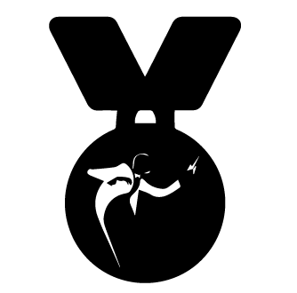

   

# 🌟 RADKit Community Leaderboard

Recognizing the developers who are building the RADKit ecosystem 
`one repository at a time`

> Last updated: April 2026

---

## 🏅 Hall of Fame

| Rank | Contributor | Challenges Completed | Featured Repository | Recognition |
|------|-------------|----------------------|---------------------|-------------|
| 🥇 1 | — | — | — | — |
| 🥈 2 | — | — | — | — |
| 🥉 3 | — | — | — | — |

*The leaderboard will be populated as the first challenge submissions are accepted.*

---

## 📊 All Contributors

| Contributor | Challenge | Repository | Accepted Date |
|-------------|-----------|------------|---------------|
| — | — | — | — |

---

## 🎖️ Recognition Tiers

| Tier | Challenges Completed | Badge |
|------|----------------------|-------|
| **RADKit Explorer** | 1 | 🌱 |
| **RADKit Builder** | 2–3 | 🔧 |
| **RADKit Champion** | 4–6 | 🏆 |
| **RADKit Legend** | 7+ | ⚡ |

---

## 📬 Want to appear here?

Browse the open challenges and submit your project:  
👉 **[RADKit Challenge Series](README.md)**