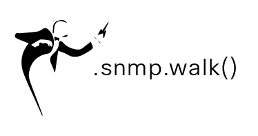

   

# 🧙🏽‍♂️ RADKit Quests Series

Welcome to the **RADKit Quests Series**: a community-driven program where Cisco RADKit developers 
tackle real-world automation topics, share their solutions, and get recognized for their contributions.

---

## How It Works

1. **Browse** the [open quests](#-open-quests) below.
2. **Build** a repository that addresses the challenge topic.
3. **Submit** by following the standard 
[Contributing Guide](https://wwwin-github.cisco.com/alfsando/how_to_radkit).
4. **Get recognized** on the [Community Leaderboard](LEADERBOARD.md).

> All submissions must comply with the 
[Project Requirements](https://wwwin-github.cisco.com/alfsando/how_to_radkit#-project-requirements) 
and be signed off with a 
[Developer Certificate of Origin](https://wwwin-github.cisco.com/alfsando/how_to_radkit#%EF%B8%8F-developer-certificate-of-origin).

---

## 🔮 Open Quests

### 🌍 Quest #001, RADKit in the Wild *(Permanent)*
**Category**: Open  
**Difficulty**: ⭐ to ⭐⭐⭐⭐⭐ *(self-assessed)*  
**Status**: 🟢 Always Open  
**Deadline**: None, submissions accepted at any time

**Description**:  
Share a real-life scenario where RADKit made a difference on your network. This is the place to 
show the community what RADKit looks like in production, whether that is a script that saved you 
hours of toil, an architecture that enabled a new capability, or a workflow that solved a problem 
that nothing else could. Sensitive details may be anonymised; what matters is the story and the 
technical substance behind it.

Format is **completely open**: a Python script, an Ansible playbook, a draw.io diagram, a 
Jupyter notebook, a short write-up, whatever best tells your story.

**Acceptance Criteria**:
- [ ] Clearly describes the real-world problem that was solved
- [ ] Explains how RADKit was central to the solution
- [ ] Contains no customer names, sensitive hostnames, credentials, or undisclosable network data
- [ ] Includes enough context for someone else to understand and adapt the approach
- [ ] Any code or config is runnable or clearly annotated where environment-specific values must be substituted

---

### 🚀 Quest #002, RADKit + CI/CD Integration
**Category**: Integration  
**Difficulty**: ⭐⭐⭐  
**Status**: 🟢 Open  
**Deadline**: June 30, 2026

**Description**:  
Build a working example that integrates RADKit into a CI/CD pipeline 
(e.g., GitHub Actions, GitLab CI, Jenkins). The project should demonstrate 
automated network validation or configuration checks triggered by a pipeline event.

**Acceptance Criteria**:
- [ ] Working pipeline configuration file included
- [ ] RADKit SDK version documented
- [ ] README with setup and run instructions
- [ ] At least one test case included

---

### 🛡️ Quest #003, Ansible Compliance Reporting & Remediation
**Category**: Automation  
**Difficulty**: ⭐⭐⭐⭐  
**Status**: 🟢 Open  
**Deadline**: September 30, 2026

**Description**:  
Build an Ansible playbook that leverages the RADKit Client SDK to audit network device 
configurations against a defined compliance policy, generate a structured report of violations, 
and automatically remediate any deviations from the desired state.

**Acceptance Criteria**:
- [ ] Ansible playbook uses the RADKit Client SDK (not the CLI) to interact with devices
- [ ] Compliance policy is expressed as a declarative, human-readable config (e.g., YAML/JSON)
- [ ] Report output includes per-device pass/fail status and details of violations
- [ ] Remediation tasks are idempotent and clearly separated from audit tasks
- [ ] README with setup, usage, and example output included
- [ ] RADKit SDK version and Ansible version documented

---

## ✅ Closed Quests

| # | Title | Winner | Repository |
|---|-------|--------|------------|
| - | No closed quests yet | - | - |

---

## 📋 Submission Checklist

Before submitting, make sure your project:

- [ ] Is relevant to the quest topic
- [ ] Includes a clear `README.md` with setup and run instructions
- [ ] Specifies the RADKit SDK version it was tested against
- [ ] Has a `LICENSE` file (Apache 2.0 recommended)
- [ ] Contains no customer names, network configs, or sensitive data
- [ ] Has all commits signed off with `git commit -s`
- [ ] Is publicly accessible

---

## 🌟 Community Leaderboard

See who is leading the RADKit Challenge Series!

👉 **[View the Full Leaderboard](LEADERBOARD.md)**

---

## 📬 Questions?

Join the conversation in our 
**[Webex Community Space](https://eurl.io/#bcVfDEUdW)** 
or email **radkit-librarians@cisco.com**.